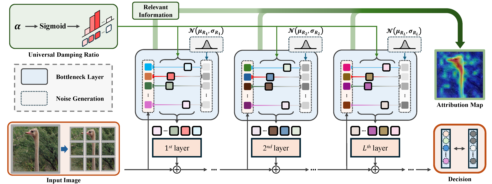

# CoIBA

This repository contains the code of **Comprehensive Information Bottleneck for Unveiling Universal Attribution to Interpret Vision Transformers**, which is presented at a Conference on Computer Vision and Pattern Recognition (CVPR) 2025 as a highlight paper.



**Paper**: CVPR 2025

**Abstract**
The feature attribution method reveals the contribution of input variables to the decision-making process to provide an attribution map for explanation. Existing methods grounded on the information bottleneck principle compute information in a specific layer to obtain attributions, compressing the features by injecting noise via a parametric damping ratio. However, the attribution obtained in a specific layer neglects evidence of the decision-making process distributed across layers. In this paper, we introduce a comprehensive information bottleneck (CoIBA), which discovers the relevant information in each targeted layer to explain the decision-making process. Our core idea is applying information bottleneck in multiple targeted layers to estimate the comprehensive information by sharing a parametric damping ratio across the layers. Leveraging this shared ratio complements the over-compressed information to discover the omitted clues of the decision by sharing the relevant information across the targeted layers. We suggest the variational approach to fairly reflect the relevant information of each layer by upper bounding layer-wise information. Therefore, CoIBA guarantees that the discarded activation is unnecessary in every targeted layer to make a decision. The extensive experimental results demonstrate the enhancement in faithfulness of the feature attributions provided by CoIBA.

## Installation
Our repository is constructed based on **Python 3.10**

Install the libraries as follows:
```
pip install -r requirements.txt
```

Or you can build a Docker image via:
```
docker build --tag <tag_name> .
```

Finally, set the simlink for the data path including {train,val} as subdirectories:
```
cd CoIBA
ln -s /path/to/imagenet ./data
```

## Visualization

```
bash run.sh
```

## Insertion and Deletion tests

```
bash run_eval.sh
```

To conduct the insertion and deletion tests with 1000 iterations, please run the command below:
```
bash run_eval.sh "--cut-off 1000"
```

## Hyperparameters
- **--start_target** indicates start layer for attribution (default: 4)
- **--end_target** indicates end layer for attribution (default: 12)
- **--op_name** indicates operation names for attribution (default: norm1)
- **--optim_steps** indicates the number of optimization steps for IBA ()
- **--iba_lr** indicates learning rate for IBA
- **--beta** indicates beta value for IBA
- **--load_estim** indicates whether to load precomputed estimators
- **--iba_path** indicates path to save/load IBA estimators

## Results
The qualitative results of ViT-B


## TIPS
Note that the we set **op_name** following the architecture of the **timm** library \
For example, CoIBA is inserted in *blocks.4.norm2 ~ blocks.8.norm2* with the setting: **--start_target 4 --end_target 8 --op_name norm2** \
The rest of the hyperparameters (**--optim_steps --iba_lr --beta**) set the iteration procedure of our CoIBA.


## BibTex

```
@inproceedings{hong2025comprehensive,
  title={Comprehensive Information Bottleneck for Unveiling Universal Attribution to Interpret Vision Transformers},
  author={Hong, Jung-Ho and Kim, Ho-Joong and Jeon, Kyu-Sung and Lee, Seong-Whan},
  booktitle={Proceedings of the Computer Vision and Pattern Recognition Conference},
  pages={25166--25175},
  year={2025}
}

```
